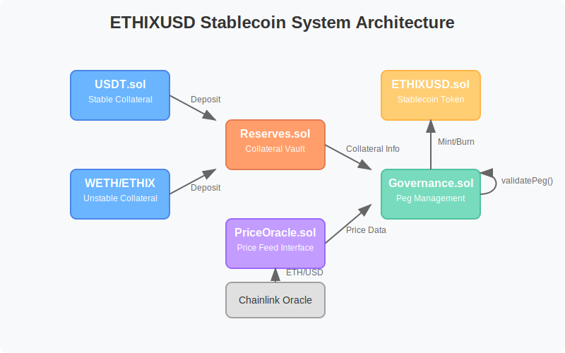
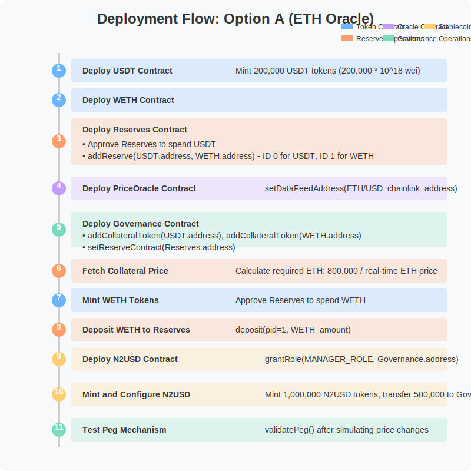
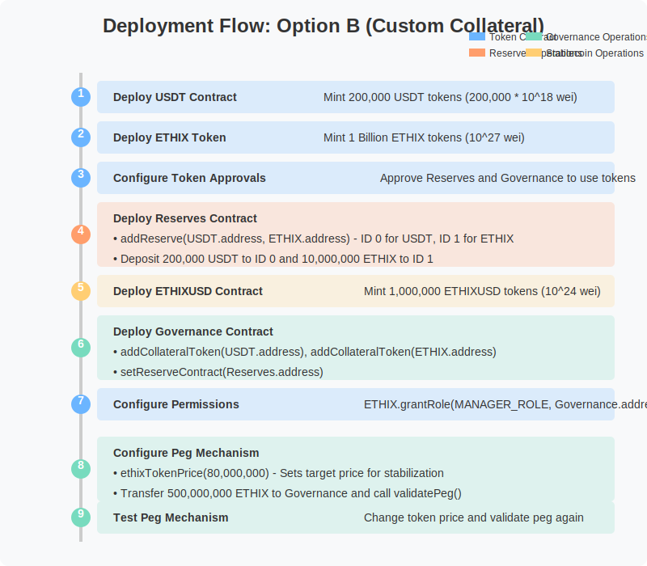

# N2USD Stablecoin Project: Technical Documentation

## Overview

This documentation outlines the implementation and deployment process for a stablecoin (N2USD) system with two alternative collateralization methods:

1. **Option A: Using real-world ETH price** - Leveraging Chainlink Oracle data feeds to maintain the peg
2. **Option B: Using custom unstable collateral** - Using N2DR token as collateral with simulated price fluctuations

Both approaches demonstrate how the governance mechanism automatically rebalances collateral to maintain the target price peg.

## System Architecture

The N2USD stablecoin system consists of several interconnected smart contracts:

```svg
<svg viewBox="0 0 800 500" xmlns="http://www.w3.org/2000/svg">
  <!-- Background -->
  <rect width="800" height="500" fill="#f8f9fa" rx="10" ry="10"/>
  
  <!-- Title -->
  <text x="400" y="40" font-family="Arial" font-size="24" text-anchor="middle" font-weight="bold" fill="#333">N2USD Stablecoin System Architecture</text>
  
  <!-- Contracts -->
  <!-- USDT Contract -->
  <rect x="100" y="100" width="140" height="70" rx="8" ry="8" fill="#6bb5ff" stroke="#4a86e8" stroke-width="2"/>
  <text x="170" y="125" font-family="Arial" font-size="16" text-anchor="middle" font-weight="bold" fill="#fff">USDT.sol</text>
  <text x="170" y="145" font-family="Arial" font-size="12" text-anchor="middle" fill="#fff">Stable Collateral</text>
  
  <!-- WETH/N2DR Contract -->
  <rect x="100" y="240" width="140" height="70" rx="8" ry="8" fill="#6bb5ff" stroke="#4a86e8" stroke-width="2"/>
  <text x="170" y="265" font-family="Arial" font-size="16" text-anchor="middle" font-weight="bold" fill="#fff">WETH/N2DR</text>
  <text x="170" y="285" font-family="Arial" font-size="12" text-anchor="middle" fill="#fff">Unstable Collateral</text>
  
  <!-- Reserves Contract -->
  <rect x="320" y="170" width="140" height="70" rx="8" ry="8" fill="#ff9e6b" stroke="#e67c52" stroke-width="2"/>
  <text x="390" y="195" font-family="Arial" font-size="16" text-anchor="middle" font-weight="bold" fill="#fff">Reserves.sol</text>
  <text x="390" y="215" font-family="Arial" font-size="12" text-anchor="middle" fill="#fff">Collateral Vault</text>
  
  <!-- PriceOracle Contract -->
  <rect x="320" y="310" width="140" height="70" rx="8" ry="8" fill="#c39cff" stroke="#9b6bff" stroke-width="2"/>
  <text x="390" y="335" font-family="Arial" font-size="16" text-anchor="middle" font-weight="bold" fill="#fff">PriceOracle.sol</text>
  <text x="390" y="355" font-family="Arial" font-size="12" text-anchor="middle" fill="#fff">Price Feed Interface</text>
  
  <!-- Governance Contract -->
  <rect x="540" y="240" width="140" height="70" rx="8" ry="8" fill="#78dbbe" stroke="#50c2a2" stroke-width="2"/>
  <text x="610" y="265" font-family="Arial" font-size="16" text-anchor="middle" font-weight="bold" fill="#fff">Governance.sol</text>
  <text x="610" y="285" font-family="Arial" font-size="12" text-anchor="middle" fill="#fff">Peg Management</text>
  
  <!-- N2USD Contract -->
  <rect x="540" y="100" width="140" height="70" rx="8" ry="8" fill="#ffce73" stroke="#ffb546" stroke-width="2"/>
  <text x="610" y="125" font-family="Arial" font-size="16" text-anchor="middle" font-weight="bold" fill="#fff">N2USD.sol</text>
  <text x="610" y="145" font-family="Arial" font-size="12" text-anchor="middle" fill="#fff">Stablecoin Token</text>
  
  <!-- Chainlink Oracle -->
  <rect x="320" y="400" width="140" height="50" rx="8" ry="8" fill="#e0e0e0" stroke="#a0a0a0" stroke-width="2"/>
  <text x="390" y="430" font-family="Arial" font-size="14" text-anchor="middle" fill="#333">Chainlink Oracle</text>
  
  <!-- Arrows -->
  <!-- USDT to Reserves -->
  <path d="M 240 135 L 305 170" stroke="#666" stroke-width="2" fill="none" marker-end="url(#arrowhead)"/>
  <text x="270" y="145" font-family="Arial" font-size="12" fill="#666">Deposit</text>
  
  <!-- WETH/N2DR to Reserves -->
  <path d="M 240 275 L 305 240" stroke="#666" stroke-width="2" fill="none" marker-end="url(#arrowhead)"/>
  <text x="270" y="270" font-family="Arial" font-size="12" fill="#666">Deposit</text>
  
  <!-- Reserves to Governance -->
  <path d="M 460 205 L 525 240" stroke="#666" stroke-width="2" fill="none" marker-end="url(#arrowhead)"/>
  <text x="490" y="215" font-family="Arial" font-size="12" fill="#666">Collateral Info</text>
  
  <!-- Oracle to Governance -->
  <path d="M 460 345 L 525 290" stroke="#666" stroke-width="2" fill="none" marker-end="url(#arrowhead)"/>
  <text x="490" y="330" font-family="Arial" font-size="12" fill="#666">Price Data</text>
  
  <!-- Chainlink to Oracle -->
  <path d="M 390 400 L 390 380" stroke="#666" stroke-width="2" fill="none" marker-end="url(#arrowhead)"/>
  <text x="405" y="390" font-family="Arial" font-size="12" fill="#666">ETH/USD</text>
  
  <!-- Governance to N2USD -->
  <path d="M 610 240 L 610 170" stroke="#666" stroke-width="2" fill="none" marker-end="url(#arrowhead)"/>
  <text x="620" y="205" font-family="Arial" font-size="12" fill="#666">Mint/Burn</text>
  
  <!-- Governance Self Loop -->
  <path d="M 680 275 C 710 275, 710 245, 680 245" stroke="#666" stroke-width="2" fill="none" marker-end="url(#arrowhead)"/>
  <text x="710" y="260" font-family="Arial" font-size="12" fill="#666">validatePeg()</text>
  
  <!-- Arrowhead marker -->
  <defs>
    <marker id="arrowhead" markerWidth="10" markerHeight="7" refX="9" refY="3.5" orient="auto">
      <polygon points="0 0, 10 3.5, 0 7" fill="#666"/>
    </marker>
  </defs>
</svg>
```

### Core Components

1. **USDT.sol**: Acts as the stable collateral token
2. **WETH.sol/N2DR.sol**: Acts as the unstable collateral token
   - WETH for Option A (using real-world ETH price)
   - N2DR for Option B (using custom unstable collateral)
3. **Reserves.sol**: Manages collateral assets
4. **PriceOracle.sol**: Interfaces with Chainlink data feeds
5. **Governance.sol**: Manages the stablecoin peg mechanism
6. **N2USD.sol**: The stablecoin token itself

## Deployment Guide

### Option A: Using Real-World ETH Price (Chainlink Oracle)


```svg
<svg viewBox="0 0 800 800" xmlns="http://www.w3.org/2000/svg">
  <!-- Background -->
  <rect width="800" height="800" fill="#f8f9fa" rx="10" ry="10"/>
  
  <!-- Title -->
  <text x="400" y="40" font-family="Arial" font-size="24" text-anchor="middle" font-weight="bold" fill="#333">Deployment Flow: Option A (ETH Oracle)</text>
  
  <!-- Timeline -->
  <line x1="100" y1="90" x2="100" y2="760" stroke="#ccc" stroke-width="4"/>
  
  <!-- Step 1 -->
  <circle cx="100" cy="120" r="12" fill="#6bb5ff"/>
  <text x="100" y="120" font-family="Arial" font-size="14" text-anchor="middle" fill="#fff" font-weight="bold">1</text>
  <rect x="120" y="100" width="640" height="40" rx="5" ry="5" fill="#6bb5ff" fill-opacity="0.2"/>
  <text x="140" y="125" font-family="Arial" font-size="14" fill="#333" font-weight="bold">Deploy USDT Contract</text>
  <text x="400" y="125" font-family="Arial" font-size="14" fill="#333">Mint 200,000 USDT tokens (200,000 * 10^18 wei)</text>
  
  <!-- Step 2 -->
  <circle cx="100" cy="170" r="12" fill="#6bb5ff"/>
  <text x="100" y="170" font-family="Arial" font-size="14" text-anchor="middle" fill="#fff" font-weight="bold">2</text>
  <rect x="120" y="150" width="640" height="40" rx="5" ry="5" fill="#6bb5ff" fill-opacity="0.2"/>
  <text x="140" y="175" font-family="Arial" font-size="14" fill="#333" font-weight="bold">Deploy WETH Contract</text>
  
  <!-- Step 3 -->
  <circle cx="100" cy="240" r="12" fill="#ff9e6b"/>
  <text x="100" y="240" font-family="Arial" font-size="14" text-anchor="middle" fill="#fff" font-weight="bold">3</text>
  <rect x="120" y="200" width="640" height="80" rx="5" ry="5" fill="#ff9e6b" fill-opacity="0.2"/>
  <text x="140" y="225" font-family="Arial" font-size="14" fill="#333" font-weight="bold">Deploy Reserves Contract</text>
  <text x="140" y="250" font-family="Arial" font-size="14" fill="#333">• Approve Reserves to spend USDT</text>
  <text x="140" y="270" font-family="Arial" font-size="14" fill="#333">• addReserve(USDT.address, WETH.address) - ID 0 for USDT, ID 1 for WETH</text>
  
  <!-- Step 4 -->
  <circle cx="100" cy="320" r="12" fill="#c39cff"/>
  <text x="100" y="320" font-family="Arial" font-size="14" text-anchor="middle" fill="#fff" font-weight="bold">4</text>
  <rect x="120" y="300" width="640" height="40" rx="5" ry="5" fill="#c39cff" fill-opacity="0.2"/>
  <text x="140" y="325" font-family="Arial" font-size="14" fill="#333" font-weight="bold">Deploy PriceOracle Contract</text>
  <text x="450" y="325" font-family="Arial" font-size="14" fill="#333">setDataFeedAddress(ETH/USD_chainlink_address)</text>
  
  <!-- Step 5 -->
  <circle cx="100" cy="390" r="12" fill="#78dbbe"/>
  <text x="100" y="390" font-family="Arial" font-size="14" text-anchor="middle" fill="#fff" font-weight="bold">5</text>
  <rect x="120" y="360" width="640" height="60" rx="5" ry="5" fill="#78dbbe" fill-opacity="0.2"/>
  <text x="140" y="385" font-family="Arial" font-size="14" fill="#333" font-weight="bold">Deploy Governance Contract</text>
  <text x="140" y="405" font-family="Arial" font-size="14" fill="#333">• addCollateralToken(USDT.address), addCollateralToken(WETH.address)</text>
  <text x="140" y="425" font-family="Arial" font-size="14" fill="#333">• setReserveContract(Reserves.address)</text>
  
  <!-- Step 6 -->
  <circle cx="100" cy="460" r="12" fill="#ff9e6b"/>
  <text x="100" y="460" font-family="Arial" font-size="14" text-anchor="middle" fill="#fff" font-weight="bold">6</text>
  <rect x="120" y="440" width="640" height="40" rx="5" ry="5" fill="#ff9e6b" fill-opacity="0.2"/>
  <text x="140" y="465" font-family="Arial" font-size="14" fill="#333" font-weight="bold">Fetch Collateral Price</text>
  <text x="400" y="465" font-family="Arial" font-size="14" fill="#333">Calculate required ETH: 800,000 / real-time ETH price</text>
  
  <!-- Step 7 -->
  <circle cx="100" cy="510" r="12" fill="#6bb5ff"/>
  <text x="100" y="510" font-family="Arial" font-size="14" text-anchor="middle" fill="#fff" font-weight="bold">7</text>
  <rect x="120" y="490" width="640" height="40" rx="5" ry="5" fill="#6bb5ff" fill-opacity="0.2"/>
  <text x="140" y="515" font-family="Arial" font-size="14" fill="#333" font-weight="bold">Mint WETH Tokens</text>
  <text x="400" y="515" font-family="Arial" font-size="14" fill="#333">Approve Reserves to spend WETH</text>
  
  <!-- Step 8 -->
  <circle cx="100" cy="560" r="12" fill="#ff9e6b"/>
  <text x="100" y="560" font-family="Arial" font-size="14" text-anchor="middle" fill="#fff" font-weight="bold">8</text>
  <rect x="120" y="540" width="640" height="40" rx="5" ry="5" fill="#ff9e6b" fill-opacity="0.2"/>
  <text x="140" y="565" font-family="Arial" font-size="14" fill="#333" font-weight="bold">Deposit WETH to Reserves</text>
  <text x="400" y="565" font-family="Arial" font-size="14" fill="#333">deposit(pid=1, WETH_amount)</text>
  
  <!-- Step 9 -->
  <circle cx="100" cy="610" r="12" fill="#ffce73"/>
  <text x="100" y="610" font-family="Arial" font-size="14" text-anchor="middle" fill="#fff" font-weight="bold">9</text>
  <rect x="120" y="590" width="640" height="40" rx="5" ry="5" fill="#ffce73" fill-opacity="0.2"/>
  <text x="140" y="615" font-family="Arial" font-size="14" fill="#333" font-weight="bold">Configure N2USD Permissions</text>
  <text x="450" y="615" font-family="Arial" font-size="14" fill="#333">grantRole(MANAGER_ROLE, Governance.address)</text>
  
  <!-- Step 10 -->
  <circle cx="100" cy="670" r="12" fill="#ffce73"/>
  <text x="100" y="670" font-family="Arial" font-size="14" text-anchor="middle" fill="#fff" font-weight="bold">10</text>
  <rect x="120" y="650" width="640" height="40" rx="5" ry="5" fill="#ffce73" fill-opacity="0.2"/>
  <text x="140" y="675" font-family="Arial" font-size="14" fill="#333" font-weight="bold">Mint and Configure N2USD</text>
  <text x="450" y="675" font-family="Arial" font-size="14" fill="#333">Mint 1,000,000 N2USD tokens, transfer 500,000 to Governance</text>
  
  <!-- Step 11 -->
  <circle cx="100" cy="730" r="12" fill="#78dbbe"/>
  <text x="100" y="730" font-family="Arial" font-size="14" text-anchor="middle" fill="#fff" font-weight="bold">11</text>
  <rect x="120" y="710" width="640" height="40" rx="5" ry="5" fill="#78dbbe" fill-opacity="0.2"/>
  <text x="140" y="735" font-family="Arial" font-size="14" fill="#333" font-weight="bold">Test Peg Mechanism</text>
  <text x="450" y="735" font-family="Arial" font-size="14" fill="#333">validatePeg() after simulating price changes</text>
  
  <!-- Legend -->
  <rect x="580" y="40" width="20" height="10" fill="#6bb5ff"/>
  <text x="605" y="50" font-family="Arial" font-size="12" fill="#333">Token Contract</text>
  
  <rect x="580" y="60" width="20" height="10" fill="#ff9e6b"/>
  <text x="605" y="70" font-family="Arial" font-size="12" fill="#333">Reserves Operations</text>
  
  <rect x="650" y="40" width="20" height="10" fill="#c39cff"/>
  <text x="675" y="50" font-family="Arial" font-size="12" fill="#333">Oracle Contract</text>
  
  <rect x="650" y="60" width="20" height="10" fill="#78dbbe"/>
  <text x="675" y="70" font-family="Arial" font-size="12" fill="#333">Governance Operations</text>
  
  <rect x="720" y="40" width="20" height="10" fill="#ffce73"/>
  <text x="745" y="50" font-family="Arial" font-size="12" fill="#333">Stablecoin Operations</text>
</svg>
```
 

#### Step-by-Step Deployment (Option A)

1. **Deploy USDT Contract**
   - Deploy the USDT.sol contract
   - Mint 200,000 USDT tokens in wei: `200,000 * 10^18 = 200,000,000,000,000,000,000,000`

2. **Deploy WETH Contract**
   - Deploy the WETH.sol contract

3. **Deploy Reserves Contract**
   - Deploy the Reserves.sol contract
   - In USDT.sol, approve the Reserves contract to spend 200,000 USDT tokens
   - In Reserves.sol, call `addReserve` function:
     - Add USDT.sol address (ID 0)
     - Add WETH.sol address (ID 1)
   - Call `deposit` function with ID 0 and amount `200,000 * 10^18`
   - Verify the amount by checking `rsvVault` for ID 0

4. **Deploy PriceOracle Contract**
   - Deploy the PriceOracle.sol contract
   - Call `setDataFeedAddress` with the Chainlink ETH/USD data feed address
   - Reference: [Chainlink Data Feeds](https://docs.chain.link/data-feeds/price-feeds/addresses?page=1&network=hedera&search=#hedera-testnet)

5. **Deploy Governance Contract**
   - Deploy the Governance-option1.sol with USDT.sol address in the constructor
   - Add collateral token addresses:
     - Call `addCollateralToken` with USDT.sol address
     - Call `addCollateralToken` with WETH.sol address
   - Set data feed address with `setDataFeedAddress`
   - Set reserve contract address with `reserveSmartContract` function

6. **Fetch Collateral Price**
   - In Reserve.sol, call `fetchCollateralPrice` to get real-time ETH/USD value
   - Check the value in `unstableColPrice` variable and convert from wei to ETH
   - Calculate required ETH amount: `800,000 / real-time ETH price`

7. **Mint WETH Tokens**
   - Mint the calculated amount of ETH in wei using WETH.sol's `mint` function
   - Call `approve` function with the Reserves.sol address and the minted amount

8. **Deposit WETH to Reserves**
   - In Reserves.sol, deposit the minted WETH amount to ID 1

9. **Configure N2USD Permissions**
   - In N2USD.sol, call `grantRole` function with:
     - Governance.sol address
     - Output of the `MANAGER_ROLE` variable

10. **Mint and Configure N2USD**
    - Mint 1,000,000 N2USD tokens in wei: `1,000,000 * 10^18`
    - Transfer 500,000 N2USD tokens to Governance.sol
    - In Governance.sol, call `validatePeg` function to equalize the stable collateral
    - Check `n2usdSupply` to view the stabilized amount

11. **Test Peg Mechanism**
    - In Reserves.sol, call `withdraw` function with:
      - pid = 1
      - Amount of ETH to withdraw (simulates ETH price change)
    - In Governance.sol, call `validatePeg` function
    - Check `n2usdSupply` to verify peg adjustment

### Option B: Using Custom Unstable Collateral (N2DR Token)


```svg
<svg viewBox="0 0 800 700" xmlns="http://www.w3.org/2000/svg">
  <!-- Background -->
  <rect width="800" height="700" fill="#f8f9fa" rx="10" ry="10"/>
  
  <!-- Title -->
  <text x="400" y="40" font-family="Arial" font-size="24" text-anchor="middle" font-weight="bold" fill="#333">Deployment Flow: Option B (Custom Collateral)</text>
  
  <!-- Timeline -->
  <line x1="100" y1="90" x2="100" y2="670" stroke="#ccc" stroke-width="4"/>
  
  <!-- Step 1 -->
  <circle cx="100" cy="120" r="12" fill="#6bb5ff"/>
  <text x="100" y="120" font-family="Arial" font-size="14" text-anchor="middle" fill="#fff" font-weight="bold">1</text>
  <rect x="120" y="100" width="640" height="40" rx="5" ry="5" fill="#6bb5ff" fill-opacity="0.2"/>
  <text x="140" y="125" font-family="Arial" font-size="14" fill="#333" font-weight="bold">Deploy USDT Contract</text>
  <text x="400" y="125" font-family="Arial" font-size="14" fill="#333">Mint 200,000 USDT tokens (200,000 * 10^18 wei)</text>
  
  <!-- Step 2 -->
  <circle cx="100" cy="170" r="12" fill="#6bb5ff"/>
  <text x="100" y="170" font-family="Arial" font-size="14" text-anchor="middle" fill="#fff" font-weight="bold">2</text>
  <rect x="120" y="150" width="640" height="40" rx="5" ry="5" fill="#6bb5ff" fill-opacity="0.2"/>
  <text x="140" y="175" font-family="Arial" font-size="14" fill="#333" font-weight="bold">Deploy N2DR Token</text>
  <text x="400" y="175" font-family="Arial" font-size="14" fill="#333">Mint 1 Billion N2DR tokens (10^27 wei)</text>
  
  <!-- Step 3 -->
  <circle cx="100" cy="220" r="12" fill="#6bb5ff"/>
  <text x="100" y="220" font-family="Arial" font-size="14" text-anchor="middle" fill="#fff" font-weight="bold">3</text>
  <rect x="120" y="200" width="640" height="40" rx="5" ry="5" fill="#6bb5ff" fill-opacity="0.2"/>
  <text x="140" y="225" font-family="Arial" font-size="14" fill="#333" font-weight="bold">Configure Token Approvals</text>
  <text x="470" y="225" font-family="Arial" font-size="14" fill="#333">Approve Reserves and Governance to use tokens</text>
  
  <!-- Step 4 -->
  <circle cx="100" cy="290" r="12" fill="#ff9e6b"/>
  <text x="100" y="290" font-family="Arial" font-size="14" text-anchor="middle" fill="#fff" font-weight="bold">4</text>
  <rect x="120" y="250" width="640" height="80" rx="5" ry="5" fill="#ff9e6b" fill-opacity="0.2"/>
  <text x="140" y="275" font-family="Arial" font-size="14" fill="#333" font-weight="bold">Deploy Reserves Contract</text>
  <text x="140" y="300" font-family="Arial" font-size="14" fill="#333">• addReserve(USDT.address, N2DR.address) - ID 0 for USDT, ID 1 for N2DR</text>
  <text x="140" y="325" font-family="Arial" font-size="14" fill="#333">• Deposit 200,000 USDT to ID 0 and 10,000,000 N2DR to ID 1</text>
  
  <!-- Step 5 -->
  <circle cx="100" cy="360" r="12" fill="#ffce73"/>
  <text x="100" y="360" font-family="Arial" font-size="14" text-anchor="middle" fill="#fff" font-weight="bold">5</text>
  <rect x="120" y="340" width="640" height="40" rx="5" ry="5" fill="#ffce73" fill-opacity="0.2"/>
  <text x="140" y="365" font-family="Arial" font-size="14" fill="#333" font-weight="bold">Deploy N2USD Contract</text>
  <text x="450" y="365" font-family="Arial" font-size="14" fill="#333">Mint 1,000,000 N2USD tokens (10^24 wei)</text>
  
  <!-- Step 6 -->
  <circle cx="100" cy="430" r="12" fill="#78dbbe"/>
  <text x="100" y="430" font-family="Arial" font-size="14" text-anchor="middle" fill="#fff" font-weight="bold">6</text>
  <rect x="120" y="390" width="640" height="80" rx="5" ry="5" fill="#78dbbe" fill-opacity="0.2"/>
  <text x="140" y="415" font-family="Arial" font-size="14" fill="#333" font-weight="bold">Deploy Governance Contract</text>
  <text x="140" y="440" font-family="Arial" font-size="14" fill="#333">• addCollateralToken(USDT.address), addCollateralToken(N2DR.address)</text>
  <text x="140" y="465" font-family="Arial" font-size="14" fill="#333">• setReserveContract(Reserves.address)</text>
  
  <!-- Step 7 -->
  <circle cx="100" cy="500" r="12" fill="#6bb5ff"/>
  <text x="100" y="500" font-family="Arial" font-size="14" text-anchor="middle" fill="#fff" font-weight="bold">7</text>
  <rect x="120" y="480" width="640" height="40" rx="5" ry="5" fill="#6bb5ff" fill-opacity="0.2"/>
  <text x="140" y="505" font-family="Arial" font-size="14" fill="#333" font-weight="bold">Configure Permissions</text>
  <text x="450" y="505" font-family="Arial" font-size="14" fill="#333">N2DR.grantRole(MANAGER_ROLE, Governance.address)</text>
  
  <!-- Step 8 -->
  <circle cx="100" cy="580" r="12" fill="#78dbbe"/>
  <text x="100" y="580" font-family="Arial" font-size="14" text-anchor="middle" fill="#fff" font-weight="bold">8</text>
  <rect x="120" y="540" width="640" height="80" rx="5" ry="5" fill="#78dbbe" fill-opacity="0.2"/>
  <text x="140" y="565" font-family="Arial" font-size="14" fill="#333" font-weight="bold">Configure Peg Mechanism</text>
  <text x="140" y="590" font-family="Arial" font-size="14" fill="#333">• setN2drTokenPrice(80,000,000) - Sets target price for stabilization</text>
  <text x="140" y="615" font-family="Arial" font-size="14" fill="#333">• Transfer 500,000,000 N2DR to Governance and call validatePeg()</text>
  
  <!-- Step 9 -->
  <circle cx="100" cy="640" r="12" fill="#78dbbe"/>
  <text x="100" y="640" font-family="Arial" font-size="14" text-anchor="middle" fill="#fff" font-weight="bold">9</text>
  <rect x="120" y="620" width="640" height="40" rx="5" ry="5" fill="#78dbbe" fill-opacity="0.2"/>
  <text x="140" y="645" font-family="Arial" font-size="14" fill="#333" font-weight="bold">Test Peg Mechanism</text>
  <text x="450" y="645" font-family="Arial" font-size="14" fill="#333">Change token price and validate peg again</text>
  
  <!-- Legend -->
  <rect x="580" y="40" width="20" height="10" fill="#6bb5ff"/>
  <text x="605" y="50" font-family="Arial" font-size="12" fill="#333">Token Contract</text>
  
  <rect x="580" y="60" width="20" height="10" fill="#ff9e6b"/>
  <text x="605" y="70" font-family="Arial" font-size="12" fill="#333">Reserves Operations</text>
  
  <rect x="650" y="40" width="20" height="10" fill="#78dbbe"/>
  <text x="675" y="50" font-family="Arial" font-size="12" fill="#333">Governance Operations</text>
  
  <rect x="650" y="60" width="20" height="10" fill="#ffce73"/>
  <text x="675" y="70" font-family="Arial" font-size="12" fill="#333">Stablecoin Operations</text>
</svg>
```
#### Step-by-Step Deployment (Option B)

1. **Deploy and Configure USDT**
   - Deploy USDT.sol contract
   - Mint 200,000 USDT tokens in wei: `200,000 * 10^18`
   - Approve Reserves.sol to spend 200,000 USDT

2. **Deploy and Configure N2DR Token**
   - Deploy N2DR.sol contract
   - Mint 1 billion N2DR tokens in wei: `10^27`
   - Approve Reserves.sol and Governance.sol to spend 1 billion N2DR tokens

3. **Deploy Reserves Contract**
   - Deploy Reserves.sol
   - Add collateral token addresses with `addReserve`:
     - USDT.sol (ID 0)
     - N2DR.sol (ID 1)
   - Deposit 200,000 USDT to ID 0
   - Deposit 10,000,000 N2DR tokens to ID 1
   - Verify deposits using `rsvVault` function

4. **Deploy N2USD**
   - Deploy N2USD.sol contract
   - Mint 1,000,000 N2USD tokens in wei: `10^24`

5. **Deploy Governance Contract**
   - Deploy Governance.sol
   - Add collateral token addresses:
     - USDT.sol
     - N2DR.sol
   - Set Reserves contract with `setReserveContract`

6. **Configure Permissions**
   - In N2DR.sol, call `grantRole` with:
     - Governance.sol address
     - MANAGER_ROLE bytes32 value

7. **Configure and Test Peg Mechanism**
   - In Governance.sol:
     - Set N2DR token price to 80,000,000 with `setN2drTokenPrice`
     - Set N2USD supply to 1,000,000 tokens
   - Transfer 500,000,000 N2DR tokens to Governance.sol
   - Call `validatePeg` function
   - Verify the following:
     - Unstable collateral amount: should show 10 million N2DR tokens
     - Unstable collateral price: should be ~0.08
     - Stable collateral amount: should show 200,000 USDT
     - Stable collateral price: should be ~10^18
     - N2DR supply: should remain at 1 billion tokens
   - Change N2DR token price with `setN2drTokenPrice`
   - Run `validatePeg` again to verify rebalancing

## Contract Interactions and Value Flows

```svg
<svg viewBox="0 0 900 650" xmlns="http://www.w3.org/2000/svg">
  <!-- Background -->
  <rect width="900" height="650" fill="#f8f9fa" rx="10" ry="10"/>
  
  <!-- Title -->
  <text x="450" y="40" font-family="Arial, sans-serif" font-size="24" font-weight="bold" text-anchor="middle" fill="#333">N2USD Stablecoin System: Contract Interactions &amp; Value Flow</text>
  
  <!-- Collateral Management Group -->
  <rect x="30" y="80" width="280" height="230" fill="#e3f2fd" stroke="#2196f3" stroke-width="2" rx="8" ry="8" opacity="0.8"/>
  <text x="170" y="105" font-family="Arial, sans-serif" font-size="18" font-weight="bold" text-anchor="middle" fill="#1565c0">Collateral Management</text>
  
  <!-- Reserves Contract -->
  <rect x="90" y="120" width="160" height="80" fill="#bbdefb" stroke="#1976d2" stroke-width="2" rx="5" ry="5"/>
  <text x="170" y="165" font-family="Arial, sans-serif" font-size="16" font-weight="bold" text-anchor="middle">Reserves.sol</text>
  
  <!-- Stable Collateral -->
  <rect x="60" y="220" width="100" height="60" fill="#e1f5fe" stroke="#03a9f4" stroke-width="2" rx="5" ry="5"/>
  <text x="110" y="250" font-family="Arial, sans-serif" font-size="14" font-weight="bold" text-anchor="middle">USDT.sol</text>
  <text x="110" y="270" font-family="Arial, sans-serif" font-size="12" text-anchor="middle">(Stable)</text>
  
  <!-- Unstable Collateral -->
  <rect x="180" y="220" width="100" height="60" fill="#e1f5fe" stroke="#03a9f4" stroke-width="2" rx="5" ry="5"/>
  <text x="230" y="250" font-family="Arial, sans-serif" font-size="14" font-weight="bold" text-anchor="middle">WETH/N2DR</text>
  <text x="230" y="270" font-family="Arial, sans-serif" font-size="12" text-anchor="middle">(Unstable)</text>
  
  <!-- Price Information Group -->
  <rect x="30" y="340" width="280" height="130" fill="#e8f5e9" stroke="#4caf50" stroke-width="2" rx="8" ry="8" opacity="0.8"/>
  <text x="170" y="365" font-family="Arial, sans-serif" font-size="18" font-weight="bold" text-anchor="middle" fill="#2e7d32">Price Information</text>
  
  <!-- Price Oracle -->
  <rect x="90" y="380" width="160" height="70" fill="#c8e6c9" stroke="#388e3c" stroke-width="2" rx="5" ry="5"/>
  <text x="170" y="415" font-family="Arial, sans-serif" font-size="16" font-weight="bold" text-anchor="middle">PriceOracle.sol</text>
  <text x="170" y="435" font-family="Arial, sans-serif" font-size="12" text-anchor="middle">(Chainlink/Custom)</text>
  
  <!-- Peg Mechanism Group -->
  <rect x="330" y="180" width="240" height="180" fill="#fff3e0" stroke="#ff9800" stroke-width="2" rx="8" ry="8" opacity="0.8"/>
  <text x="450" y="205" font-family="Arial, sans-serif" font-size="18" font-weight="bold" text-anchor="middle" fill="#e65100">Peg Mechanism</text>
  
  <!-- Governance Contract -->
  <rect x="370" y="220" width="160" height="120" fill="#ffe0b2" stroke="#f57c00" stroke-width="2" rx="5" ry="5"/>
  <text x="450" y="270" font-family="Arial, sans-serif" font-size="16" font-weight="bold" text-anchor="middle">Governance.sol</text>
  <text x="450" y="290" font-family="Arial, sans-serif" font-size="12" text-anchor="middle">(Peg Stabilization)</text>
  
  <!-- Stablecoin Issuance Group -->
  <rect x="590" y="180" width="240" height="180" fill="#f3e5f5" stroke="#9c27b0" stroke-width="2" rx="8" ry="8" opacity="0.8"/>
  <text x="710" y="205" font-family="Arial, sans-serif" font-size="18" font-weight="bold" text-anchor="middle" fill="#6a1b9a">Stablecoin Issuance</text>
  
  <!-- N2USD Contract -->
  <rect x="630" y="220" width="160" height="120" fill="#e1bee7" stroke="#8e24aa" stroke-width="2" rx="5" ry="5"/>
  <text x="710" y="270" font-family="Arial, sans-serif" font-size="16" font-weight="bold" text-anchor="middle">N2USD.sol</text>
  <text x="710" y="290" font-family="Arial, sans-serif" font-size="12" text-anchor="middle">(Stablecoin Token)</text>
  
  <!-- User Interactions Group -->
  <rect x="330" y="400" width="500" height="140" fill="#fce4ec" stroke="#e91e63" stroke-width="2" rx="8" ry="8" opacity="0.8"/>
  <text x="580" y="425" font-family="Arial, sans-serif" font-size="18" font-weight="bold" text-anchor="middle" fill="#c2185b">User Interactions</text>
  
  <!-- User -->
  <circle cx="580" cy="480" r="40" fill="#f8bbd0" stroke="#d81b60" stroke-width="2"/>
  <text x="580" y="485" font-family="Arial, sans-serif" font-size="16" font-weight="bold" text-anchor="middle">Users</text>
  
  <!-- Arrows for Value Flow -->
  <!-- Stable Collateral to Reserves -->
  <path d="M110,220 L110,200 L170,200 L170,200" stroke="#0277bd" stroke-width="2" fill="none" marker-end="url(#arrowhead)"/>
  <text x="140" y="195" font-family="Arial, sans-serif" font-size="10" fill="#0277bd">Deposit</text>
  
  <!-- Unstable Collateral to Reserves -->
  <path d="M230,220 L230,200 L170,200" stroke="#0277bd" stroke-width="2" fill="none" marker-end="url(#arrowhead)"/>
  <text x="210" y="195" font-family="Arial, sans-serif" font-size="10" fill="#0277bd">Deposit</text>
  
  <!-- Reserves to Governance -->
  <path d="M250,160 C300,160 350,250 370,270" stroke="#0277bd" stroke-width="2" fill="none" marker-end="url(#arrowhead)"/>
  <text x="290" y="200" font-family="Arial, sans-serif" font-size="10" fill="#0277bd">Collateral Info</text>
  
  <!-- Price Oracle to Governance -->
  <path d="M250,410 C300,410 350,330 370,290" stroke="#2e7d32" stroke-width="2" fill="none" marker-end="url(#arrowhead)"/>
  <text x="300" y="380" font-family="Arial, sans-serif" font-size="10" fill="#2e7d32">Price Data</text>
  
  <!-- Governance to N2USD (Mint/Burn) -->
  <path d="M530,270 L630,270" stroke="#e65100" stroke-width="2" fill="none" marker-end="url(#arrowhead)"/>
  <text x="580" y="260" font-family="Arial, sans-serif" font-size="10" fill="#e65100">Mint/Burn</text>
  
  <!-- Governance to Governance (Validate Peg) -->
  <path d="M450,340 C450,370 500,370 500,340 L500,310" stroke="#e65100" stroke-width="2" fill="none" marker-end="url(#arrowhead)"/>
  <text x="475" y="375" font-family="Arial, sans-serif" font-size="10" fill="#e65100">Validate Peg</text>
  
  <!-- User to N2USD -->
  <path d="M610,450 L670,340" stroke="#c2185b" stroke-width="2" fill="none" marker-end="url(#arrowhead)"/>
  <text x="650" y="410" font-family="Arial, sans-serif" font-size="10" fill="#c2185b">Buy/Sell/Transfer</text>
  
  <!-- User to Governance -->
  <path d="M550,450 L490,340" stroke="#c2185b" stroke-width="2" fill="none" marker-end="url(#arrowhead)"/>
  <text x="510" y="410" font-family="Arial, sans-serif" font-size="10" fill="#c2185b">Governance Actions</text>
  
  <!-- Legend -->
  <rect x="600" y="80" width="270" height="80" fill="#ffffff" stroke="#757575" stroke-width="1" rx="5" ry="5"/>
  <text x="735" y="100" font-family="Arial, sans-serif" font-size="14" font-weight="bold" text-anchor="middle" fill="#333">Legend</text>
  
  <line x1="620" y1="120" x2="640" y2="120" stroke="#0277bd" stroke-width="2"/>
  <text x="730" y="125" font-family="Arial, sans-serif" font-size="12" fill="#333">Collateral Flow</text>
  
  <line x1="620" y1="145" x2="640" y2="145" stroke="#e65100" stroke-width="2"/>
  <text x="735" y="150" font-family="Arial, sans-serif" font-size="12" fill="#333">Stabilization Operations</text>
  
  <!-- Note on Options -->
  <rect x="30" y="490" width="280" height="110" fill="#ffffff" stroke="#757575" stroke-width="1" rx="5" ry="5"/>
  <text x="170" y="510" font-family="Arial, sans-serif" font-size="14" font-weight="bold" text-anchor="middle" fill="#333">Implementation Options</text>
  <text x="45" y="530" font-family="Arial, sans-serif" font-size="12" fill="#333">Option A: WETH + Chainlink Oracle</text>
  <text x="45" y="550" font-family="Arial, sans-serif" font-size="12" fill="#333">Option B: N2DR + Custom Price Feed</text>
  <text x="45" y="570" font-family="Arial, sans-serif" font-size="12" fill="#333">Both maintain peg through rebalancing</text>
  
  <!-- System Features -->
  <rect x="330" y="560" width="500" height="60" fill="#e0f7fa" stroke="#00bcd4" stroke-width="1" rx="5" ry="5"/>
  <text x="580" y="580" font-family="Arial, sans-serif" font-size="14" font-weight="bold" text-anchor="middle" fill="#006064">System Features</text>
  <text x="400" y="600" font-family="Arial, sans-serif" font-size="12" fill="#333">• Automatic collateral rebalancing</text>
  <text x="650" y="600" font-family="Arial, sans-serif" font-size="12" fill="#333">• Price-pegged stability mechanism</text>
  
  <!-- Arrowhead Marker -->
  <defs>
    <marker id="arrowhead" markerWidth="10" markerHeight="7" refX="9" refY="3.5" orient="auto">
      <polygon points="0 0, 10 3.5, 0 7" fill="#000"/>
    </marker>
  </defs>
</svg>
```

## Important Notes

- **Option A** uses Chainlink Oracle for real-world ETH price data
- **Option B** allows price simulation via the `setN2drTokenPrice` function
- Both options demonstrate how the stablecoin maintains its peg through automatic rebalancing
- The governance contract is key to maintaining the peg value
- To stabilize the stablecoin, always run `validatePeg` after collateral price changes

