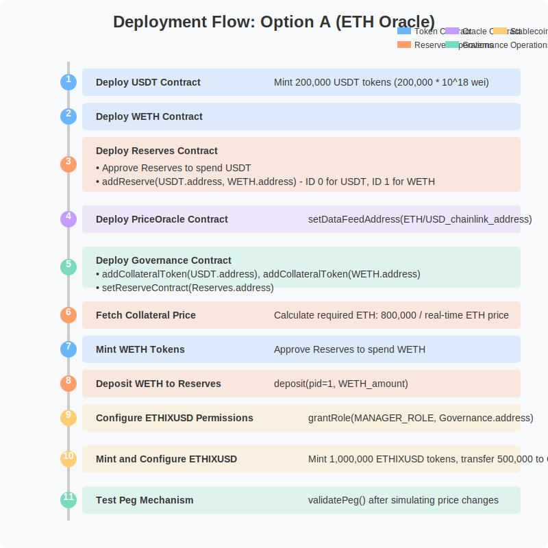

# ETHIXUSD Stablecoin Project: Technical Documentation

## Overview

This documentation outlines the implementation and deployment process for a stablecoin (ETHIXUSD) system with two alternative collateralization methods:

1. **Option A: Using real-world ETH price** - Leveraging Chainlink Oracle data feeds to maintain the peg
2. **Option B: Using custom unstable collateral** - Using ETHIX token as collateral with simulated price fluctuations

Both approaches demonstrate how the governance mechanism automatically rebalances collateral to maintain the target price peg.

## System Architecture

The ETHIXUSD stablecoin system consists of several interconnected smart contracts:

### Core Components

1. **USDT.sol**: Acts as the stable collateral token
2. **WETH.sol/ETHIX.sol**: Acts as the unstable collateral token
   - WETH for Option A (using real-world ETH price)
   - ETHIX for Option B (using custom unstable collateral)
3. **Reserves.sol**: Manages collateral assets
4. **PriceOracle.sol**: Interfaces with Chainlink data feeds
5. **Governance.sol**: Manages the stablecoin peg mechanism
6. **ETHIXUSD.sol**: The stablecoin token itself

## Deployment Guide

### Option A: Using Real-World ETH Price (Chainlink Oracle)

 

#### Step-by-Step Deployment (Option A)

1. **Deploy USDT Contract**
   - Deploy the USDT.sol contract
   - Mint 200,000 USDT tokens in wei: `200,000 * 10^18 = 200,000,000,000,000,000,000,000`

2. **Deploy WETH Contract**
   - Deploy the WETH.sol contract

3. **Deploy Reserves Contract**
   - Deploy the Reserves.sol contract
   - In USDT.sol, approve the Reserves contract to spend 200,000 USDT tokens
   - In Reserves.sol, call `addReserve` function:
     - Add USDT.sol address (ID 0)
     - Add WETH.sol address (ID 1)
   - Call `deposit` function with ID 0 and amount `200,000 * 10^18`
   - Verify the amount by checking `rsvVault` for ID 0

4. **Deploy PriceOracle Contract**
   - Deploy the PriceOracle.sol contract
   - Call `setDataFeedAddress` with the Chainlink ETH/USD data feed address
   - Reference: [Chainlink Data Feeds](https://docs.chain.link/data-feeds/price-feeds/addresses?page=1&network=hedera&search=#hedera-testnet)

5. **Deploy Governance Contract**
   - Deploy the Governance-option1.sol with USDT.sol address in the constructor
   - Add collateral token addresses:
     - Call `addCollateralToken` with USDT.sol address
     - Call `addCollateralToken` with WETH.sol address
   - Set data feed address with `setDataFeedAddress`
   - Set reserve contract address with `reserveSmartContract` function

6. **Fetch Collateral Price**
   - In Reserve.sol, call `fetchCollateralPrice` to get real-time ETH/USD value
   - Check the value in `unstableColPrice` variable and convert from wei to ETH
   - Calculate required ETH amount: `800,000 / real-time ETH price`

7. **Mint WETH Tokens**
   - Mint the calculated amount of ETH in wei using WETH.sol's `mint` function
   - Call `approve` function with the Reserves.sol address and the minted amount

8. **Deposit WETH to Reserves**
   - In Reserves.sol, deposit the minted WETH amount to ID 1

9. **Configure ETHIXUSD Permissions**
   - In ETHIXUSD.sol, call `grantRole` function with:
     - Governance.sol address
     - Output of the `MANAGER_ROLE` variable

10. **Mint and Configure ETHIXUSD**
    - Mint 1,000,000 ETHIXUSD tokens in wei: `1,000,000 * 10^18`
    - Transfer 500,000 ETHIXUSD tokens to Governance.sol
    - In Governance.sol, call `validatePeg` function to equalize the stable collateral
    - Check `ethixUSDsupply` to view the stabilized amount

11. **Test Peg Mechanism**
    - In Reserves.sol, call `withdraw` function with:
      - pid = 1
      - Amount of ETH to withdraw (simulates ETH price change)
    - In Governance.sol, call `validatePeg` function
    - Check `ethixUSDsupply` to verify peg adjustment

### Option B: Using Custom Unstable Collateral (ETHIX Token)

#### Step-by-Step Deployment (Option B)

1. **Deploy and Configure USDT**
   - Deploy USDT.sol contract
   - Mint 200,000 USDT tokens in wei: `200,000 * 10^18`
   - Approve Reserves.sol to spend 200,000 USDT

2. **Deploy and Configure ETHIX Token**
   - Deploy ETHIX.sol contract
   - Mint 1 billion ETHIX tokens in wei: `10^27`
   - Approve Reserves.sol and Governance.sol to spend 1 billion ETHIX tokens

3. **Deploy Reserves Contract**
   - Deploy Reserves.sol
   - Add collateral token addresses with `addReserve`:
     - USDT.sol (ID 0)
     - ETHIX.sol (ID 1)
   - Deposit 200,000 USDT to ID 0
   - Deposit 10,000,000 ETHIX tokens to ID 1
   - Verify deposits using `rsvVault` function

4. **Deploy ETHIXUSD**
   - Deploy ETHIXUSD.sol contract
   - Mint 1,000,000 ETHIXUSD tokens in wei: `10^24`

5. **Deploy Governance Contract**
   - Deploy Governance.sol
   - Add collateral token addresses:
     - USDT.sol
     - ETHIX.sol
   - Set Reserves contract with `setReserveContract`

6. **Configure Permissions**
   - In ETHIX.sol, call `grantRole` with:
     - Governance.sol address
     - MANAGER_ROLE bytes32 value

7. **Configure and Test Peg Mechanism**
   - In Governance.sol:
     - Set ETHIX token price to 80,000,000 with `ethixTokenPrice`
     - Set ETHIXUSD supply to 1,000,000 tokens
   - Transfer 500,000,000 ETHIX tokens to Governance.sol
   - Call `validatePeg` function
   - Verify the following:
     - Unstable collateral amount: should show 10 million ETHIX tokens
     - Unstable collateral price: should be ~0.08
     - Stable collateral amount: should show 200,000 USDT
     - Stable collateral price: should be ~10^18
     - ETHIX supply: should remain at 1 billion tokens
   - Change ETHIX token price with `ethixTokenPrice`
   - Run `validatePeg` again to verify rebalancing

## Contract Interactions and Value Flows

## Important Notes

- **Option A** uses Chainlink Oracle for real-world `ETH` price data and `WETH.sol` contract.
- **Option B** allows price simulation via the `ethixTokenPrice` function of the `ETHIX.sol` contract.
- Both options demonstrate how the stablecoin maintains its peg through automatic rebalancing
- The `governance` contract is key to maintaining the peg value
- To stabilize the stablecoin, always run `validatePeg` after collateral price changes

